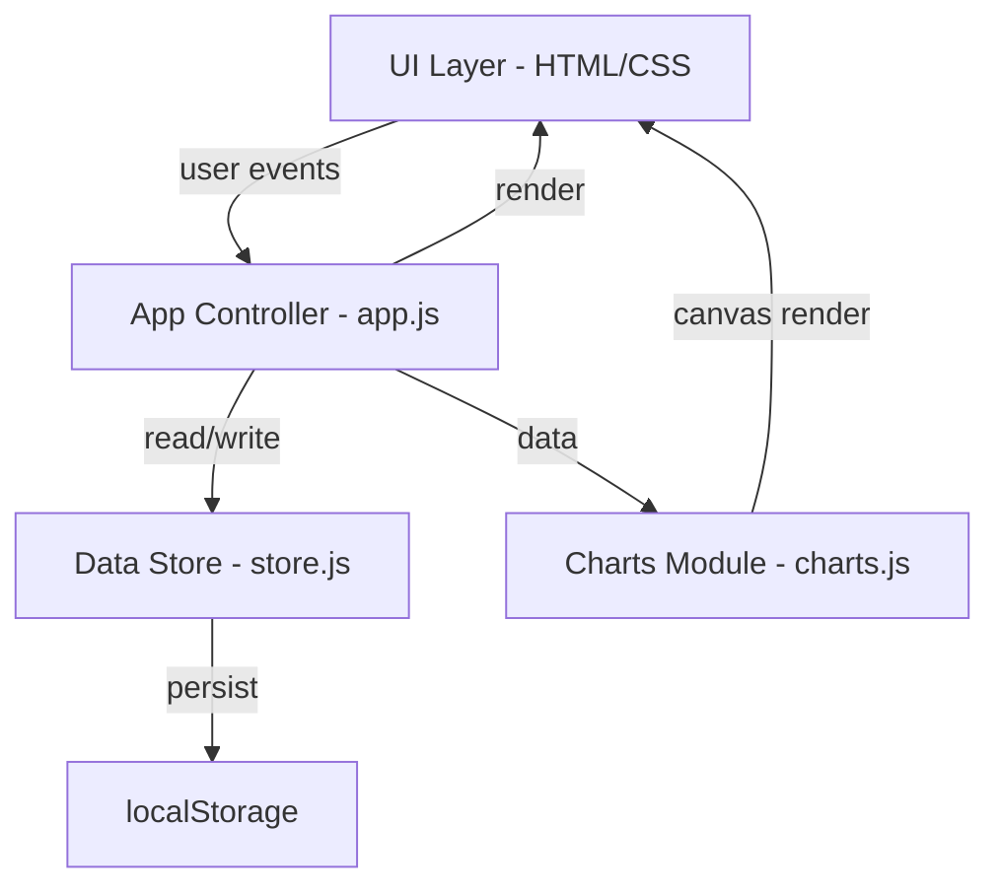
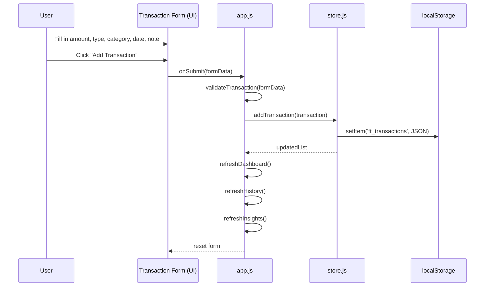
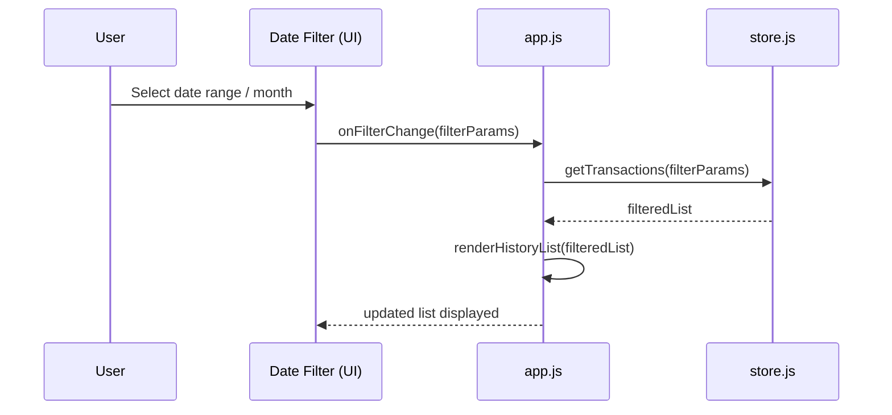

# Design Document: Finance Tracker

## Overview

A client-side Finance Tracker web application built with HTML, CSS, and JavaScript that allows users to add and categorize transactions, track income vs expenses, view transaction history by date, and gain basic insights into their spending patterns. All data is persisted in the browser via `localStorage` — no backend required.

The app is structured as a single-page application (SPA) with distinct UI panels: a dashboard summary, a transaction form, a filterable history list, and an insights/charts section.

## Architecture



### File Structure

```
Finance-Tracker-Using-Kiro-IDE/
├── index.html
├── css/
│   └── style.css
└── js/
    ├── app.js        # Main controller, event wiring
    ├── store.js      # Data layer (localStorage CRUD)
    ├── ui.js         # DOM rendering helpers
    └── charts.js     # Canvas-based chart rendering
```

## Sequence Diagrams

### Add Transaction Flow



### Filter History by Date Flow



## Components and Interfaces

### Component 1: Dashboard Summary

**Purpose**: Shows real-time totals for total balance, total income, and total expenses.

**Interface**:
```javascript
// Rendered by ui.js
function renderDashboard(summary) {
  // summary: { balance: number, income: number, expenses: number }
}
```

**Responsibilities**:
- Display current balance (income - expenses)
- Show total income and total expenses as cards
- Update reactively after every transaction add/delete

---

### Component 2: Transaction Form

**Purpose**: Collects user input to create a new transaction.

**Interface**:
```javascript
function getFormData() {
  // returns TransactionInput object from DOM fields
}

function resetForm() {
  // clears all form fields
}
```

**Responsibilities**:
- Capture: amount, type (income/expense), category, date, optional note
- Validate inputs before submission
- Emit submit event to app controller

---

### Component 3: Transaction History List

**Purpose**: Displays a scrollable, filterable list of all transactions.

**Interface**:
```javascript
function renderHistoryList(transactions) {
  // transactions: Transaction[]
}

function applyFilters(filters) {
  // filters: { month: string, type: string, category: string }
}
```

**Responsibilities**:
- Render each transaction as a list item with date, category badge, amount, and delete button
- Support filtering by month, type, and category
- Color-code income (green) vs expense (red)

---

### Component 4: Insights Panel

**Purpose**: Provides visual spending breakdowns.

**Interface**:
```javascript
function renderInsights(transactions) {
  // renders category breakdown bar chart and income vs expense summary
}
```

**Responsibilities**:
- Category-wise expense breakdown (bar chart via Canvas API)
- Income vs Expense comparison (summary cards or simple chart)
- Top spending category highlight

---

### Component 5: Data Store

**Purpose**: Abstracts all localStorage read/write operations.

**Interface**:
```javascript
function getAllTransactions()           // returns Transaction[]
function addTransaction(t)             // saves new transaction, returns updated list
function deleteTransaction(id)         // removes by id, returns updated list
function getTransactions(filters)      // returns filtered Transaction[]
function getSummary()                  // returns { balance, income, expenses }
function getCategoryBreakdown()        // returns { [category]: totalAmount }
```

---

## Data Models

### Transaction

```javascript
/**
 * @typedef {Object} Transaction
 * @property {string}  id         - UUID (crypto.randomUUID or timestamp-based)
 * @property {'income'|'expense'} type
 * @property {number}  amount     - Positive number
 * @property {string}  category   - e.g. "Food", "Salary", "Rent", "Entertainment"
 * @property {string}  date       - ISO date string "YYYY-MM-DD"
 * @property {string}  note       - Optional description
 * @property {number}  createdAt  - Unix timestamp for sort order
 */
```

**Validation Rules**:
- `amount` must be a positive number greater than 0
- `type` must be exactly `'income'` or `'expense'`
- `category` must be a non-empty string from the predefined list
- `date` must be a valid date string, not in the future beyond today

### Summary

```javascript
/**
 * @typedef {Object} Summary
 * @property {number} balance   - income total - expense total
 * @property {number} income    - sum of all income transactions
 * @property {number} expenses  - sum of all expense transactions
 */
```

### Filters

```javascript
/**
 * @typedef {Object} Filters
 * @property {string} month     - "YYYY-MM" or "" for all
 * @property {string} type      - "income" | "expense" | "" for all
 * @property {string} category  - category name or "" for all
 */
```

---

## Key Functions with Formal Specifications

### `addTransaction(transactionInput)`

```javascript
function addTransaction(transactionInput) {
  // Reads existing list, appends new transaction, writes back to localStorage
}
```

**Preconditions:**
- `transactionInput.amount > 0`
- `transactionInput.type` is `'income'` or `'expense'`
- `transactionInput.category` is non-empty
- `transactionInput.date` is a valid ISO date string

**Postconditions:**
- A new `Transaction` object with a unique `id` is appended to the stored list
- `getAllTransactions().length` increases by exactly 1
- `localStorage` is updated with the new list

**Loop Invariants:** N/A

---

### `deleteTransaction(id)`

```javascript
function deleteTransaction(id) {
  // Filters out transaction with matching id and writes back
}
```

**Preconditions:**
- `id` is a non-empty string
- A transaction with `id` exists in the store

**Postconditions:**
- Transaction with matching `id` is removed from the list
- `getAllTransactions().length` decreases by exactly 1
- `localStorage` is updated

---

### `getSummary()`

```javascript
function getSummary() {
  // Reduces all transactions to { balance, income, expenses }
}
```

**Preconditions:**
- `getAllTransactions()` returns a valid array (may be empty)

**Postconditions:**
- `summary.income` equals sum of all `amount` where `type === 'income'`
- `summary.expenses` equals sum of all `amount` where `type === 'expense'`
- `summary.balance === summary.income - summary.expenses`

**Loop Invariants:**
- Running totals `incomeAcc` and `expenseAcc` are always non-negative during reduction

---

### `getTransactions(filters)`

```javascript
function getTransactions(filters) {
  // Returns transactions matching all provided filter criteria
}
```

**Preconditions:**
- `filters` is an object (fields may be empty strings meaning "no filter")

**Postconditions:**
- Every returned transaction satisfies all non-empty filter criteria
- If all filters are empty, returns all transactions
- Result is sorted by `date` descending

---

## Algorithmic Pseudocode

### Main Initialization Algorithm

```pascal
ALGORITHM initApp()
INPUT: none
OUTPUT: rendered UI

BEGIN
  transactions ← store.getAllTransactions()
  
  renderDashboard(store.getSummary())
  renderHistoryList(transactions)
  renderInsights(transactions)
  
  bindEventListeners()
END
```

---

### Add Transaction Algorithm

```pascal
ALGORITHM handleAddTransaction(formData)
INPUT: formData (amount, type, category, date, note)
OUTPUT: updated UI

BEGIN
  errors ← validateTransaction(formData)
  
  IF errors IS NOT EMPTY THEN
    displayValidationErrors(errors)
    RETURN
  END IF
  
  transaction ← {
    id: generateId(),
    type: formData.type,
    amount: parseFloat(formData.amount),
    category: formData.category,
    date: formData.date,
    note: formData.note,
    createdAt: Date.now()
  }
  
  store.addTransaction(transaction)
  
  resetForm()
  renderDashboard(store.getSummary())
  renderHistoryList(store.getTransactions(currentFilters))
  renderInsights(store.getAllTransactions())
END
```

---

### Filter History Algorithm

```pascal
ALGORITHM handleFilterChange(filterParams)
INPUT: filterParams (month, type, category)
OUTPUT: filtered history list rendered

BEGIN
  currentFilters ← filterParams
  filtered ← store.getTransactions(filterParams)
  renderHistoryList(filtered)
END
```

---

### Category Breakdown Algorithm

```pascal
ALGORITHM getCategoryBreakdown(transactions)
INPUT: transactions (Transaction[])
OUTPUT: breakdown ({ category → total })

BEGIN
  breakdown ← {}
  
  FOR each t IN transactions DO
    IF t.type = 'expense' THEN
      IF breakdown[t.category] EXISTS THEN
        breakdown[t.category] ← breakdown[t.category] + t.amount
      ELSE
        breakdown[t.category] ← t.amount
      END IF
    END IF
  END FOR
  
  RETURN breakdown
END
```

**Loop Invariants:**
- `breakdown` only contains expense-type transactions
- All accumulated values are non-negative

---

## Example Usage

```javascript
// Initialize app on page load
document.addEventListener('DOMContentLoaded', initApp);

// Add a transaction
const formData = {
  amount: '1500',
  type: 'income',
  category: 'Salary',
  date: '2025-07-15',
  note: 'Monthly salary'
};
handleAddTransaction(formData);

// Filter history to July 2025 expenses only
handleFilterChange({ month: '2025-07', type: 'expense', category: '' });

// Get spending summary
const summary = store.getSummary();
// { balance: 1500, income: 1500, expenses: 0 }

// Get category breakdown for insights
const breakdown = getCategoryBreakdown(store.getAllTransactions());
// { Salary: 1500 }
```

---

## Correctness Properties

- For all transactions `t` in the store: `t.amount > 0`
- For all transactions `t`: `t.type ∈ { 'income', 'expense' }`
- `summary.balance === summary.income - summary.expenses` always holds
- `getTransactions(filters)` returns a subset of `getAllTransactions()`
- After `addTransaction(t)`, `getAllTransactions()` contains `t`
- After `deleteTransaction(id)`, no transaction with `id` exists in the store
- `getCategoryBreakdown()` only includes expense-type transactions

---

## Error Handling

### Scenario 1: Invalid Amount

**Condition**: User submits a non-numeric or zero/negative amount
**Response**: Show inline validation error "Please enter a valid positive amount"
**Recovery**: Form remains open, field highlighted in red

### Scenario 2: Missing Required Fields

**Condition**: Category or date not selected
**Response**: Highlight empty fields, show error message
**Recovery**: Form stays populated, user corrects and resubmits

### Scenario 3: localStorage Unavailable

**Condition**: Browser blocks localStorage (private mode edge cases)
**Response**: Catch the error, fall back to in-memory array for the session
**Recovery**: App still functions; warn user data won't persist

### Scenario 4: Corrupt localStorage Data

**Condition**: Stored JSON is malformed
**Response**: Catch JSON.parse error, reset store to empty array
**Recovery**: App starts fresh, old data is cleared

---

## Testing Strategy

### Unit Testing Approach

Test each store function in isolation:
- `addTransaction` with valid and invalid inputs
- `deleteTransaction` with existing and non-existing IDs
- `getSummary` with mixed income/expense transactions
- `getTransactions` with various filter combinations
- `getCategoryBreakdown` with empty and populated lists

### Property-Based Testing Approach

**Property Test Library**: fast-check

Key properties:
- `getSummary().balance` always equals `income - expenses` for any transaction set
- `getTransactions({})` always returns the full list
- Adding then deleting a transaction leaves the list unchanged
- `getCategoryBreakdown` totals never exceed total expenses

### Integration Testing Approach

- Full add → display → delete cycle via DOM interaction
- Filter combinations produce correct subsets
- localStorage persistence across simulated page reloads

---

## Performance Considerations

- All operations are O(n) over the transaction list; acceptable for personal finance use (< 10,000 transactions)
- Chart rendering uses native Canvas API — no heavy charting library dependency
- DOM updates are batched per user action (no continuous polling)
- `localStorage` reads happen once on init; subsequent operations use in-memory cache

---

## Security Considerations

- All user input is sanitized before inserting into the DOM (use `textContent` not `innerHTML` for user data)
- Amount values are parsed with `parseFloat` and validated as finite positive numbers
- No external API calls; all data stays client-side
- No sensitive financial data is transmitted anywhere

---

## Dependencies

- **None** — pure HTML, CSS, and vanilla JavaScript
- Canvas API (built into all modern browsers) for charts
- `localStorage` API for persistence
- `crypto.randomUUID()` or timestamp-based ID generation for transaction IDs
